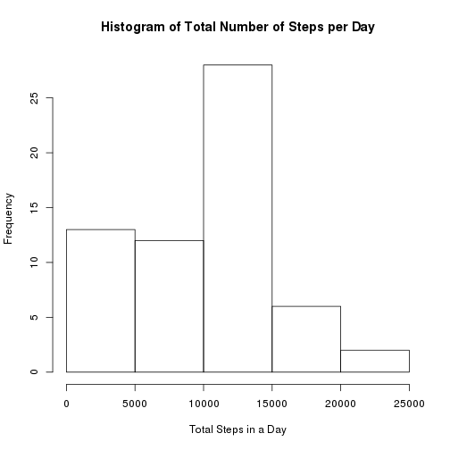
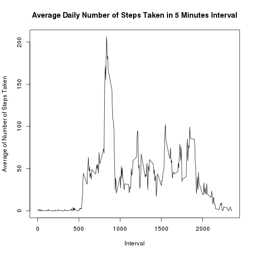
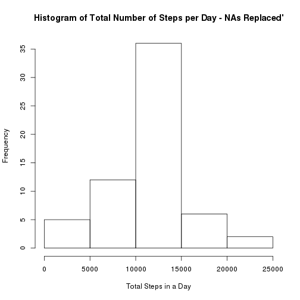
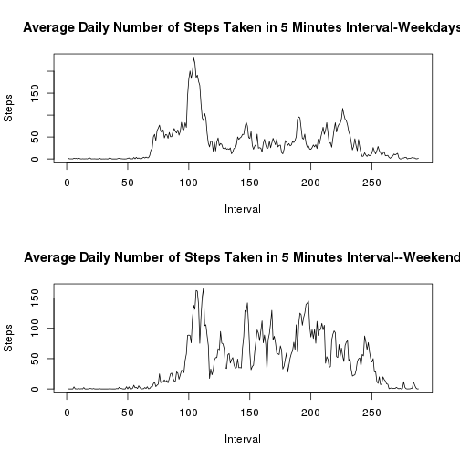

## Loading and preprocessing the data  

```r
# setwd("~/Downloads/RepData_PeerAssessment1")
# disabled because there are better alternative (download.file) which will easen for non-technical people
# and can be run from any working directory
# download file from repository link
download.file("https://d396qusza40orc.cloudfront.net/repdata/data/activity.zip",destfile="activity.zip")
# unzip and read the downloaded file into R
raw.data<-read.csv(unz("activity.zip","activity.csv"),sep=",",na.strings="NA",stringsAsFactors=FALSE)
# strptime date from date column
date<-strptime(raw.data$date,format="%Y-%m-%d")
# make the interval value more uniform in number format
interval<-formatC(raw.data$interval,width=4,flag="0")
# construct date.time which contain date and time interval value in POSIXlt and POSIXct
date.time<-strptime(paste(raw.data$date,interval),format="%Y-%m-%d %H%M")
```

## What is mean total number of steps taken per day?  
1. Calculate the total number of steps taken per day    
2. If you do not understand the difference between a histogram and a barplot, research the difference between them. Make a histogram of the total number of steps taken each day     
3. Calculate and report the mean and median of the total number of steps taken per day  

```r
# calculate for total number of steps per day
tot.steps.date<-as.numeric(tapply(raw.data$steps,raw.data$date,sum,na.rm=TRUE))
# plot histogram of total number of steps oer day
hist(tot.steps.date,main="Histogram of Total Number of Steps per Day",xlab="Total Steps in a Day",ylab="Frequency")
```



```r
# calculate mean of total numbers of steps taken per days
mean.steps.date<-mean(tot.steps.date,na.rm=TRUE)
mean.steps.date
```

```
## [1] 9354.23
```

```r
# calculate median of total numbers of steps taken per days
median.steps.date<-median(tot.steps.date,na.rm=TRUE)
median.steps.date
```

```
## [1] 10395
```

## What is the average daily activity pattern?  
1. Make a time series plot (i.e. type = "l") of the 5-minute interval (x-axis) and the average number of steps taken, averaged across all days (y-axis)  
2. Which 5-minute interval, on average across all the days in the dataset, contains the maximum number of steps?  

```r
# averaging number of the 5 minute interval (x axis), and steps taken, averaged across all day(y axis)
interval.steps.date<-as.numeric(lapply(split(raw.data$steps,raw.data$interval),mean,na.rm=TRUE))
# construct a plot of interval and average steps taken across all days
plot(unique((interval)),interval.steps.date,type="l",main="Average Daily Number of Steps Taken in 5 Minutes Interval",xlab="Interval",ylab="Average of Number of Steps Taken")
```



```r
# find 5 minute interval across all the days in the data sets  that contain the max number of steps
interval[which.max(interval.steps.date)]
```

```
## [1] "0835"
```

## Imputing missing values  
Note that there are a number of days/intervals where there are missing values (coded as NA). The presence of missing days may introduce bias into some calculations or summaries of the data.  
1. Calculate and report the total number of missing values in the dataset (i.e. the total number of rows with NAs)  
2. Devise a strategy for filling in all of the missing values in the dataset. The strategy does not need to be sophisticated. For example, you could use the mean/median for that day, or the mean for that 5-minute interval, etc.  
3. Create a new dataset that is equal to the original dataset but with the missing data filled in.  
4. Make a histogram of the total number of steps taken each day and Calculate and report the mean and median total number of steps taken per day. Do these values differ from the estimates from the first part of the assignment? What is the impact of imputing missing data on the estimates of the total daily number of steps?  

```r
# calculate and report number of missing values in the data sets
colSums(is.na(raw.data))
```

```
##    steps     date interval 
##     2304        0        0
```

```r
# calculate filling values
# means of steps taken for the corresponding day
fill.mean.date<-(tapply(raw.data$steps,raw.data$date,mean,na.rm=TRUE))
# medians of steps taken for the corresponding day
fill.median.date<-(tapply(raw.data$steps,raw.data$date,median,na.rm=TRUE))
# means of steps taken for the corresponding interval
fill.mean.interval<-(tapply(raw.data$steps,raw.data$interval,mean,na.rm=TRUE))
# medians of steps taken for the corresponding interval
fill.median.interval<-(tapply(raw.data$steps,raw.data$interval,median,na.rm=TRUE))
# check for each filling strategy
fill.mean.date
```

```
## 2012-10-01 2012-10-02 2012-10-03 2012-10-04 2012-10-05 2012-10-06 
##        NaN  0.4375000 39.4166667 42.0694444 46.1597222 53.5416667 
## 2012-10-07 2012-10-08 2012-10-09 2012-10-10 2012-10-11 2012-10-12 
## 38.2465278        NaN 44.4826389 34.3750000 35.7777778 60.3541667 
## 2012-10-13 2012-10-14 2012-10-15 2012-10-16 2012-10-17 2012-10-18 
## 43.1458333 52.4236111 35.2048611 52.3750000 46.7083333 34.9166667 
## 2012-10-19 2012-10-20 2012-10-21 2012-10-22 2012-10-23 2012-10-24 
## 41.0729167 36.0937500 30.6284722 46.7361111 30.9652778 29.0104167 
## 2012-10-25 2012-10-26 2012-10-27 2012-10-28 2012-10-29 2012-10-30 
##  8.6527778 23.5347222 35.1354167 39.7847222 17.4236111 34.0937500 
## 2012-10-31 2012-11-01 2012-11-02 2012-11-03 2012-11-04 2012-11-05 
## 53.5208333        NaN 36.8055556 36.7048611        NaN 36.2465278 
## 2012-11-06 2012-11-07 2012-11-08 2012-11-09 2012-11-10 2012-11-11 
## 28.9375000 44.7326389 11.1770833        NaN        NaN 43.7777778 
## 2012-11-12 2012-11-13 2012-11-14 2012-11-15 2012-11-16 2012-11-17 
## 37.3784722 25.4722222        NaN  0.1423611 18.8923611 49.7881944 
## 2012-11-18 2012-11-19 2012-11-20 2012-11-21 2012-11-22 2012-11-23 
## 52.4652778 30.6979167 15.5277778 44.3993056 70.9270833 73.5902778 
## 2012-11-24 2012-11-25 2012-11-26 2012-11-27 2012-11-28 2012-11-29 
## 50.2708333 41.0902778 38.7569444 47.3819444 35.3576389 24.4687500 
## 2012-11-30 
##        NaN
```

```r
fill.median.date
```

```
## 2012-10-01 2012-10-02 2012-10-03 2012-10-04 2012-10-05 2012-10-06 
##         NA          0          0          0          0          0 
## 2012-10-07 2012-10-08 2012-10-09 2012-10-10 2012-10-11 2012-10-12 
##          0         NA          0          0          0          0 
## 2012-10-13 2012-10-14 2012-10-15 2012-10-16 2012-10-17 2012-10-18 
##          0          0          0          0          0          0 
## 2012-10-19 2012-10-20 2012-10-21 2012-10-22 2012-10-23 2012-10-24 
##          0          0          0          0          0          0 
## 2012-10-25 2012-10-26 2012-10-27 2012-10-28 2012-10-29 2012-10-30 
##          0          0          0          0          0          0 
## 2012-10-31 2012-11-01 2012-11-02 2012-11-03 2012-11-04 2012-11-05 
##          0         NA          0          0         NA          0 
## 2012-11-06 2012-11-07 2012-11-08 2012-11-09 2012-11-10 2012-11-11 
##          0          0          0         NA         NA          0 
## 2012-11-12 2012-11-13 2012-11-14 2012-11-15 2012-11-16 2012-11-17 
##          0          0         NA          0          0          0 
## 2012-11-18 2012-11-19 2012-11-20 2012-11-21 2012-11-22 2012-11-23 
##          0          0          0          0          0          0 
## 2012-11-24 2012-11-25 2012-11-26 2012-11-27 2012-11-28 2012-11-29 
##          0          0          0          0          0          0 
## 2012-11-30 
##         NA
```

```r
fill.mean.interval
```

```
##           0           5          10          15          20          25 
##   1.7169811   0.3396226   0.1320755   0.1509434   0.0754717   2.0943396 
##          30          35          40          45          50          55 
##   0.5283019   0.8679245   0.0000000   1.4716981   0.3018868   0.1320755 
##         100         105         110         115         120         125 
##   0.3207547   0.6792453   0.1509434   0.3396226   0.0000000   1.1132075 
##         130         135         140         145         150         155 
##   1.8301887   0.1698113   0.1698113   0.3773585   0.2641509   0.0000000 
##         200         205         210         215         220         225 
##   0.0000000   0.0000000   1.1320755   0.0000000   0.0000000   0.1320755 
##         230         235         240         245         250         255 
##   0.0000000   0.2264151   0.0000000   0.0000000   1.5471698   0.9433962 
##         300         305         310         315         320         325 
##   0.0000000   0.0000000   0.0000000   0.0000000   0.2075472   0.6226415 
##         330         335         340         345         350         355 
##   1.6226415   0.5849057   0.4905660   0.0754717   0.0000000   0.0000000 
##         400         405         410         415         420         425 
##   1.1886792   0.9433962   2.5660377   0.0000000   0.3396226   0.3584906 
##         430         435         440         445         450         455 
##   4.1132075   0.6603774   3.4905660   0.8301887   3.1132075   1.1132075 
##         500         505         510         515         520         525 
##   0.0000000   1.5660377   3.0000000   2.2452830   3.3207547   2.9622642 
##         530         535         540         545         550         555 
##   2.0943396   6.0566038  16.0188679  18.3396226  39.4528302  44.4905660 
##         600         605         610         615         620         625 
##  31.4905660  49.2641509  53.7735849  63.4528302  49.9622642  47.0754717 
##         630         635         640         645         650         655 
##  52.1509434  39.3396226  44.0188679  44.1698113  37.3584906  49.0377358 
##         700         705         710         715         720         725 
##  43.8113208  44.3773585  50.5094340  54.5094340  49.9245283  50.9811321 
##         730         735         740         745         750         755 
##  55.6792453  44.3207547  52.2641509  69.5471698  57.8490566  56.1509434 
##         800         805         810         815         820         825 
##  73.3773585  68.2075472 129.4339623 157.5283019 171.1509434 155.3962264 
##         830         835         840         845         850         855 
## 177.3018868 206.1698113 195.9245283 179.5660377 183.3962264 167.0188679 
##         900         905         910         915         920         925 
## 143.4528302 124.0377358 109.1132075 108.1132075 103.7169811  95.9622642 
##         930         935         940         945         950         955 
##  66.2075472  45.2264151  24.7924528  38.7547170  34.9811321  21.0566038 
##        1000        1005        1010        1015        1020        1025 
##  40.5660377  26.9811321  42.4150943  52.6603774  38.9245283  50.7924528 
##        1030        1035        1040        1045        1050        1055 
##  44.2830189  37.4150943  34.6981132  28.3396226  25.0943396  31.9433962 
##        1100        1105        1110        1115        1120        1125 
##  31.3584906  29.6792453  21.3207547  25.5471698  28.3773585  26.4716981 
##        1130        1135        1140        1145        1150        1155 
##  33.4339623  49.9811321  42.0377358  44.6037736  46.0377358  59.1886792 
##        1200        1205        1210        1215        1220        1225 
##  63.8679245  87.6981132  94.8490566  92.7735849  63.3962264  50.1698113 
##        1230        1235        1240        1245        1250        1255 
##  54.4716981  32.4150943  26.5283019  37.7358491  45.0566038  67.2830189 
##        1300        1305        1310        1315        1320        1325 
##  42.3396226  39.8867925  43.2641509  40.9811321  46.2452830  56.4339623 
##        1330        1335        1340        1345        1350        1355 
##  42.7547170  25.1320755  39.9622642  53.5471698  47.3207547  60.8113208 
##        1400        1405        1410        1415        1420        1425 
##  55.7547170  51.9622642  43.5849057  48.6981132  35.4716981  37.5471698 
##        1430        1435        1440        1445        1450        1455 
##  41.8490566  27.5094340  17.1132075  26.0754717  43.6226415  43.7735849 
##        1500        1505        1510        1515        1520        1525 
##  30.0188679  36.0754717  35.4905660  38.8490566  45.9622642  47.7547170 
##        1530        1535        1540        1545        1550        1555 
##  48.1320755  65.3207547  82.9056604  98.6603774 102.1132075  83.9622642 
##        1600        1605        1610        1615        1620        1625 
##  62.1320755  64.1320755  74.5471698  63.1698113  56.9056604  59.7735849 
##        1630        1635        1640        1645        1650        1655 
##  43.8679245  38.5660377  44.6603774  45.4528302  46.2075472  43.6792453 
##        1700        1705        1710        1715        1720        1725 
##  46.6226415  56.3018868  50.7169811  61.2264151  72.7169811  78.9433962 
##        1730        1735        1740        1745        1750        1755 
##  68.9433962  59.6603774  75.0943396  56.5094340  34.7735849  37.4528302 
##        1800        1805        1810        1815        1820        1825 
##  40.6792453  58.0188679  74.6981132  85.3207547  59.2641509  67.7735849 
##        1830        1835        1840        1845        1850        1855 
##  77.6981132  74.2452830  85.3396226  99.4528302  86.5849057  85.6037736 
##        1900        1905        1910        1915        1920        1925 
##  84.8679245  77.8301887  58.0377358  53.3584906  36.3207547  20.7169811 
##        1930        1935        1940        1945        1950        1955 
##  27.3962264  40.0188679  30.2075472  25.5471698  45.6603774  33.5283019 
##        2000        2005        2010        2015        2020        2025 
##  19.6226415  19.0188679  19.3396226  33.3396226  26.8113208  21.1698113 
##        2030        2035        2040        2045        2050        2055 
##  27.3018868  21.3396226  19.5471698  21.3207547  32.3018868  20.1509434 
##        2100        2105        2110        2115        2120        2125 
##  15.9433962  17.2264151  23.4528302  19.2452830  12.4528302   8.0188679 
##        2130        2135        2140        2145        2150        2155 
##  14.6603774  16.3018868   8.6792453   7.7924528   8.1320755   2.6226415 
##        2200        2205        2210        2215        2220        2225 
##   1.4528302   3.6792453   4.8113208   8.5094340   7.0754717   8.6981132 
##        2230        2235        2240        2245        2250        2255 
##   9.7547170   2.2075472   0.3207547   0.1132075   1.6037736   4.6037736 
##        2300        2305        2310        2315        2320        2325 
##   3.3018868   2.8490566   0.0000000   0.8301887   0.9622642   1.5849057 
##        2330        2335        2340        2345        2350        2355 
##   2.6037736   4.6981132   3.3018868   0.6415094   0.2264151   1.0754717
```

```r
fill.median.interval
```

```
##    0    5   10   15   20   25   30   35   40   45   50   55  100  105  110 
##    0    0    0    0    0    0    0    0    0    0    0    0    0    0    0 
##  115  120  125  130  135  140  145  150  155  200  205  210  215  220  225 
##    0    0    0    0    0    0    0    0    0    0    0    0    0    0    0 
##  230  235  240  245  250  255  300  305  310  315  320  325  330  335  340 
##    0    0    0    0    0    0    0    0    0    0    0    0    0    0    0 
##  345  350  355  400  405  410  415  420  425  430  435  440  445  450  455 
##    0    0    0    0    0    0    0    0    0    0    0    0    0    0    0 
##  500  505  510  515  520  525  530  535  540  545  550  555  600  605  610 
##    0    0    0    0    0    0    0    0    0    0    0    0    0    0    0 
##  615  620  625  630  635  640  645  650  655  700  705  710  715  720  725 
##    0    0    0    0    0    0    0    8   13    7   13   14    0    0   12 
##  730  735  740  745  750  755  800  805  810  815  820  825  830  835  840 
##    0    0   15   19   19   28   41   25   32   13   45   33   37   19   51 
##  845  850  855  900  905  910  915  920  925  930  935  940  945  950  955 
##   60   16   43   20    8   31   15   16    0    0    0    0    0    0    0 
## 1000 1005 1010 1015 1020 1025 1030 1035 1040 1045 1050 1055 1100 1105 1110 
##    0    0    0    0    0    0    0    0    0    0    0    0    0    0    0 
## 1115 1120 1125 1130 1135 1140 1145 1150 1155 1200 1205 1210 1215 1220 1225 
##    0    0    0    0    0    0    0    0    0    0    0    6   10    0    0 
## 1230 1235 1240 1245 1250 1255 1300 1305 1310 1315 1320 1325 1330 1335 1340 
##    0    0    0    0    0    0    0    0    0    0    0    0    0    0    0 
## 1345 1350 1355 1400 1405 1410 1415 1420 1425 1430 1435 1440 1445 1450 1455 
##    0    0    0    0    0    0    0    0    0    0    0    0    0    0    0 
## 1500 1505 1510 1515 1520 1525 1530 1535 1540 1545 1550 1555 1600 1605 1610 
##    0    0    0    0    0    0    0    0    0    0    0    0    0    0    0 
## 1615 1620 1625 1630 1635 1640 1645 1650 1655 1700 1705 1710 1715 1720 1725 
##    0    0    0    0    0    0    0    0    0    0    0    0    7    7    0 
## 1730 1735 1740 1745 1750 1755 1800 1805 1810 1815 1820 1825 1830 1835 1840 
##    7    7   26    7    0   10   15   18   26   25   24    9   33   26   34 
## 1845 1850 1855 1900 1905 1910 1915 1920 1925 1930 1935 1940 1945 1950 1955 
##   42   33   30   33   30    8    8    7    0    0    0    0    0    0    0 
## 2000 2005 2010 2015 2020 2025 2030 2035 2040 2045 2050 2055 2100 2105 2110 
##    0    0    0    0    0    0    0    0    0    0    0    0    0    0    0 
## 2115 2120 2125 2130 2135 2140 2145 2150 2155 2200 2205 2210 2215 2220 2225 
##    0    0    0    0    0    0    0    0    0    0    0    0    0    0    0 
## 2230 2235 2240 2245 2250 2255 2300 2305 2310 2315 2320 2325 2330 2335 2340 
##    0    0    0    0    0    0    0    0    0    0    0    0    0    0    0 
## 2345 2350 2355 
##    0    0    0
```

```r
# READ THE ASSUMPTION MADE: fill.mean.interval is used as filling value
# we chooses fill.mean.interval as filling value
fill.data<-raw.data
fill.data[is.na(fill.data)]<-round(fill.mean.interval)
# calculate for total number of steps per day of filled dataset
fill.tot.steps.date<-as.numeric(tapply(fill.data$steps,fill.data$date,sum,na.rm=TRUE))
#compare the value with the version where na is omitted
cbind(tot.steps.date,fill.tot.steps.date)
```

```
##       tot.steps.date fill.tot.steps.date
##  [1,]              0               10762
##  [2,]            126                 126
##  [3,]          11352               11352
##  [4,]          12116               12116
##  [5,]          13294               13294
##  [6,]          15420               15420
##  [7,]          11015               11015
##  [8,]              0               10762
##  [9,]          12811               12811
## [10,]           9900                9900
## [11,]          10304               10304
## [12,]          17382               17382
## [13,]          12426               12426
## [14,]          15098               15098
## [15,]          10139               10139
## [16,]          15084               15084
## [17,]          13452               13452
## [18,]          10056               10056
## [19,]          11829               11829
## [20,]          10395               10395
## [21,]           8821                8821
## [22,]          13460               13460
## [23,]           8918                8918
## [24,]           8355                8355
## [25,]           2492                2492
## [26,]           6778                6778
## [27,]          10119               10119
## [28,]          11458               11458
## [29,]           5018                5018
## [30,]           9819                9819
## [31,]          15414               15414
## [32,]              0               10762
## [33,]          10600               10600
## [34,]          10571               10571
## [35,]              0               10762
## [36,]          10439               10439
## [37,]           8334                8334
## [38,]          12883               12883
## [39,]           3219                3219
## [40,]              0               10762
## [41,]              0               10762
## [42,]          12608               12608
## [43,]          10765               10765
## [44,]           7336                7336
## [45,]              0               10762
## [46,]             41                  41
## [47,]           5441                5441
## [48,]          14339               14339
## [49,]          15110               15110
## [50,]           8841                8841
## [51,]           4472                4472
## [52,]          12787               12787
## [53,]          20427               20427
## [54,]          21194               21194
## [55,]          14478               14478
## [56,]          11834               11834
## [57,]          11162               11162
## [58,]          13646               13646
## [59,]          10183               10183
## [60,]           7047                7047
## [61,]              0               10762
```

```r
# construct histogram of total number of steps taken each day of filled dataset
hist(fill.tot.steps.date,main="Histogram of Total Number of Steps per Day - NAs Replaced'",xlab="Total Steps in a Day",ylab="Frequency")
```



```r
# mean of total number of steps taken each of filled dataset
fill.mean.steps.date<-mean(fill.tot.steps.date,na.rm=TRUE)
#compare the value with the version where na is omitted
c(mean.steps.date,fill.mean.steps.date)
```

```
## [1]  9354.23 10765.64
```

```r
# median of total number of steps taken each of filled dataset
fill.median.steps.date<-median(fill.tot.steps.date,na.rm=TRUE)
#compare the value with the version where na is omitted
c(median.steps.date,fill.median.steps.date)
```

```
## [1] 10395 10762
```

## Are there differences in activity patterns between weekdays and weekends?  
For this part the weekdays() function may be of some help here. Use the dataset with the filled-in missing values for this part.  
1. Create a new factor variable in the dataset with two levels – “weekday” and “weekend” indicating whether a given date is a weekday or weekend day.  
2. Make a panel plot containing a time series plot (i.e. type = "l") of the 5-minute interval (x-axis) and the average number of steps taken, averaged across all weekday days or weekend days (y-axis). See the README file in the GitHub repository to see an example of what this plot should look like using simulated data.  

```r
# create a new factor in the filled dataset with two levels "weekday" and "weekends"
# create the factor object by assuming that "Saturday" and "Sunday" as weekend, and the rests as weekdays
days<-weekdays(date.time)
days.index<-(unique(weekdays(date.time)))
days[days %in% days.index[1:5]]<-"Weekdays"
days[days %in% days.index[5:7]]<-"Weekend"
# create new factor.data by append days to fill.dataset
factor.data<-cbind(fill.data,days)
# split into weekdats and weekend data frame
weekdays.data<-split(factor.data,factor.data$days)$Weekdays
weekend.data<-split(factor.data,factor.data$days)$Weekend
# average number of steps taken each day across all weekdays of filled weekdays dataset
weekdays.interval.steps.date<-as.numeric(lapply(split(weekdays.data$steps,weekdays.data$interval),mean,na.rm=TRUE))
# average number of steps taken each day across all weekend of filled weekend dataset
weekend.interval.steps.date<-as.numeric(lapply(split(weekend.data$steps,weekend.data$interval),mean,na.rm=TRUE))
# construct a layout for the plot1
par(mfrow=c(2,1))
# construct histogram of average number of steps taken each day across all weekdays of filled weekdays dataset
plot(weekdays.interval.steps.date,type="l",main="Average Daily Number of Steps Taken in 5 Minutes Interval-Weekdays",xlab="Interval",ylab="Steps")
# construct histogram of average number of steps taken each day across all weekend of filled weekend dataset
plot(weekend.interval.steps.date,type="l",main="Average Daily Number of Steps Taken in 5 Minutes Interval--Weekend",xlab="Interval",ylab="Steps")
```


